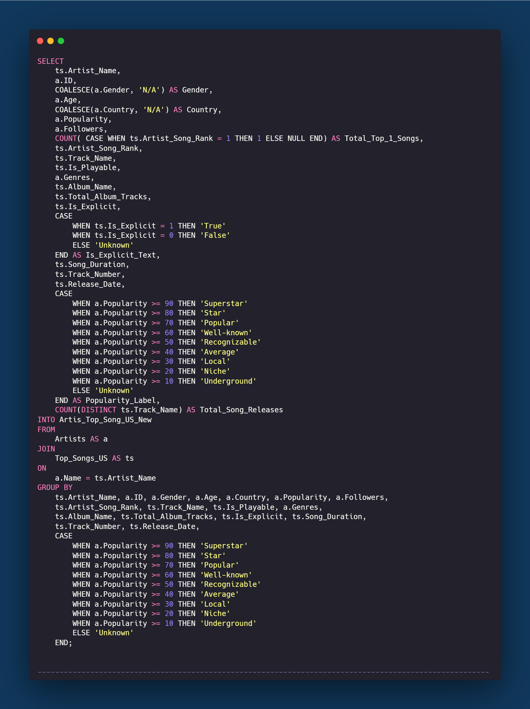
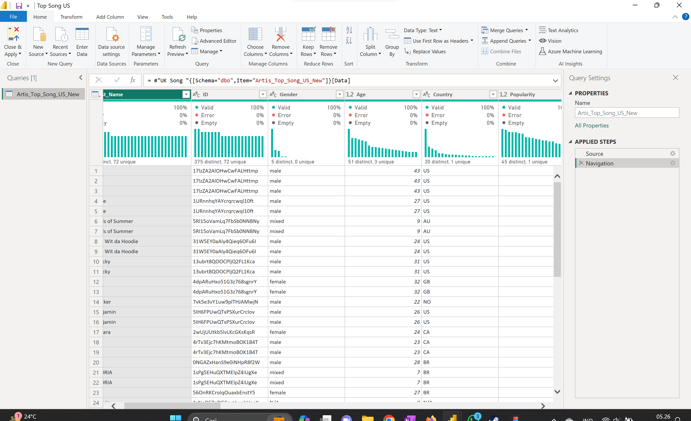
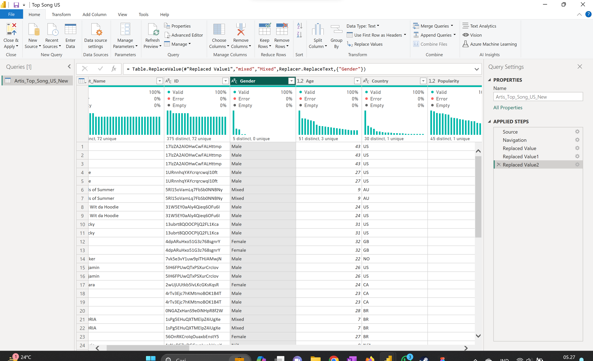
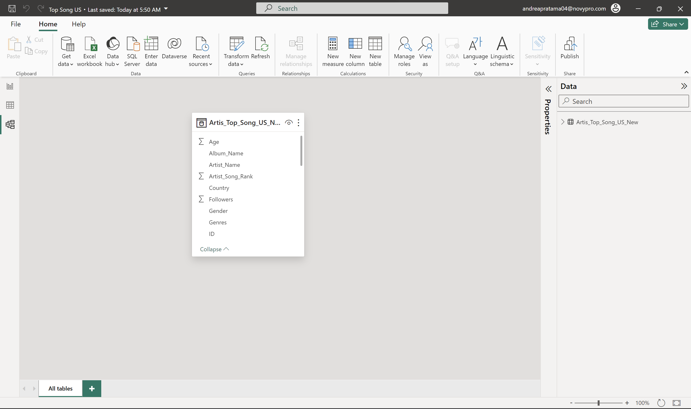
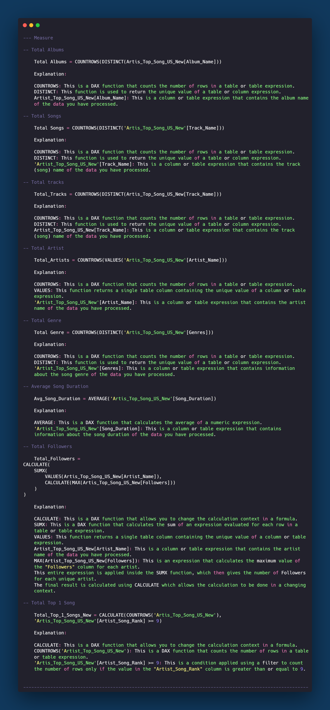

# Top US Song

# Top US Song Data Analysis Project

## Introduction

This project involves the analysis of top songs in the United States using Microsoft SQL Server and Power BI. The dataset, sourced from Kaggle, encompasses information about artists, song ranks, genres, popularity, and more. The primary objective is to derive insights into the music industry, artist trends, and song characteristics.

## Problem Statement

The music industry is dynamic and competitive. Understanding the factors that contribute to a song's success and an artist's popularity can provide valuable insights, including artists, record labels, and music enthusiasts. This project aims to address the following questions:

- What are the key characteristics of top-ranking songs?
- How do different artists and genres perform in the US music scene?
- Can we identify patterns or trends in the release and popularity of songs over time?

## Skills Demonstrated

This project demonstrates proficiency in the following skills:

- Data cleaning and validation using Microsoft SQL Server.
- Data visualization and analysis using Power BI.
- Utilization of DAX (Data Analysis Expressions) for calculations in Power BI.

## Data Sourcing

The dataset used in this project was obtained from Kaggle, a reliable source for music-related data. It includes information about artists, song ranks, genres, popularity, followers, and other relevant attributes.

## Data Transformation

The data underwent a comprehensive cleaning and validation process to ensure accuracy and consistency. SQL queries were employed to merge and transform data from multiple tables, creating a cohesive dataset for analysis.

### Query SQL For Data Cleaning & Validation

### Change the value in Power BI

| Before Transformation            | After Transformation            |
|----------------------------------|---------------------------------|
|  |  |

_Focus on Gender Column_

## Modeling

The analysis involves the creation of a new table, "Artis_Top_Song_US_New," which combines artist and song information. This table forms the basis for subsequent analyses and visualizations.

### Dax used in Power BI

## Analyze & Visualization

The Power BI dashboard created for this project includes:

- Filter functions for country and artist name.
- Card visuals displaying total songs, total albums, total followers, and total tracks.
- Visualizations depicting song release trends and competition among artists by gender.
- Bar charts illustrating average song duration, top-ranked songs, total songs by genre, and artists categorized by popularity label.

_You can interact with report Here [Novypro](https://www.novypro.com/project/top-us-song)_

## Conclusion & Recommendation

In conclusion, this data analysis project provides valuable insights into the US music industry. Understanding the patterns and trends within the data can help artists, record labels, and other stakeholders make informed decisions. Recommendations for further analysis and improvements to the dataset may include exploring additional features or incorporating external data sources.

